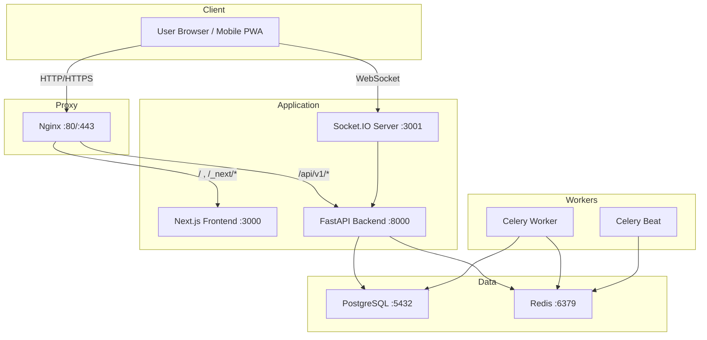
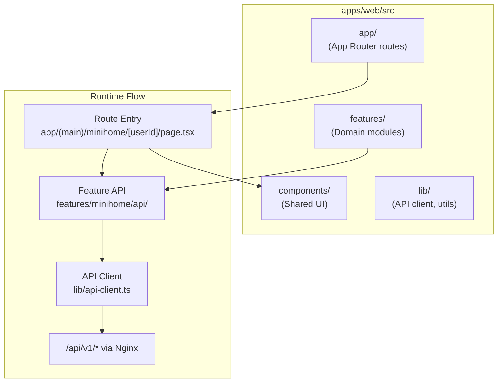
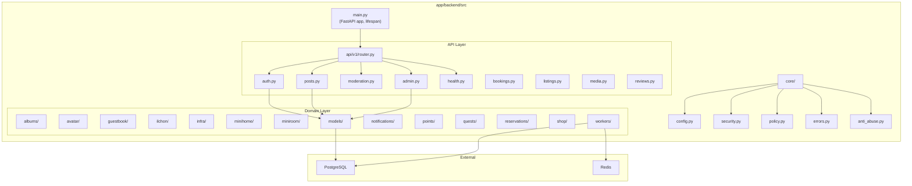
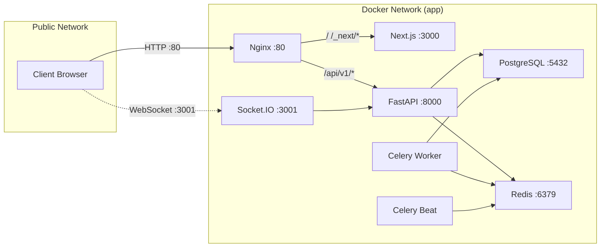
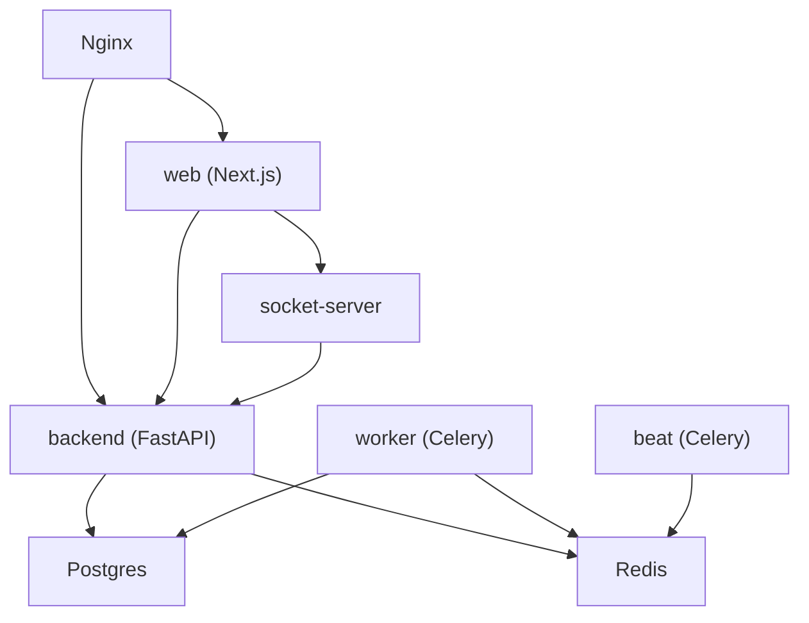
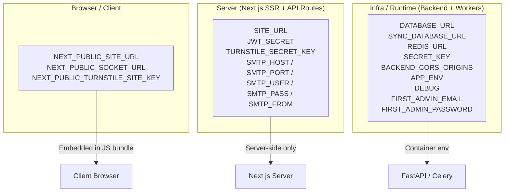

# thai_ja_world SYSTEM ARCHITECTURE v2

> **Status**: Official System Architecture Reference
> **Last Updated**: 2026-03-13
> **Scope**: Full-stack architecture for the thai_ja_world (태자) community platform

---

## 1. System Overview

thai_ja_world is a Korean-language community platform targeting the Korean expatriate community in Pattaya, Thailand. The platform combines a traditional community board (posts, reviews, marketplace, meetups, job listings) with social features inspired by Cyworld (minihome, guestbook, avatar, miniroom, shop, points, quests).

The system is a monorepo containing a Next.js frontend, a FastAPI backend, a Socket.IO real-time server, and supporting infrastructure (PostgreSQL, Redis, Celery, Nginx), all orchestrated via Docker Compose.

### Technology Stack

| Layer | Technology |
|-------|-----------|
| Frontend | Next.js 14 (App Router) + TypeScript + Tailwind CSS + PWA |
| Backend | FastAPI + SQLAlchemy 2 + Pydantic v2 + JWT |
| Real-time | Socket.IO (Node.js) |
| Database | PostgreSQL 16 |
| Cache / Queue | Redis 7 |
| Task Worker | Celery (worker + beat) |
| Reverse Proxy | Nginx |
| Containerization | Docker Compose |
| Admin | Separate Next.js app (`apps/admin`) — not yet integrated into Compose |

---

## 2. Architecture Principles

1. **Reverse-proxy-first routing**: All browser traffic enters through Nginx. The frontend calls the backend via the same-origin path `/api/v1/*`, eliminating CORS complexity for standard REST calls.

2. **Domain-driven module boundaries**: Both frontend and backend organize code by domain (minihome, shop, avatar, guestbook, etc.) rather than by technical layer alone.

3. **Separation of presentation and domain logic**: The frontend separates reusable UI (`components/`) from domain feature modules (`features/`). The backend separates routing (`api/v1/*.py`) from domain modules (`api/v1/domain/*`).

4. **Async-first backend**: FastAPI with async SQLAlchemy for I/O-bound operations. Celery handles background and scheduled tasks.

5. **Environment variable discipline**: Server-only variables and client-exposed variables (`NEXT_PUBLIC_*`) are strictly separated. The `SITE_URL` / `NEXT_PUBLIC_SITE_URL` distinction is critical for auth callback URLs.

6. **Container isolation**: Each service runs in its own container with explicit health checks and dependency ordering.

---

## 3. Runtime Architecture

### ASCII Overview

```
 ┌─────────────────────────────┐
 │   User Browser / Mobile PWA │
 └─────────────┬───────────────┘
               │
               ▼
 ┌─────────────────────────────┐
 │     Nginx  :80 / :443       │
 │  (reverse proxy + rate limit)│
 ├──────────┬──────────────────┤
 │ /        │ /api/v1/*        │
 │ /_next/* │                  │
 ▼          ▼                  │
┌────────┐ ┌────────┐         │
│Next.js │ │FastAPI │         │
│ :3000  │ │ :8000  │         │
└────────┘ └───┬────┘         │
               │              │
       ┌───────┼───────┐      │
       ▼       ▼       ▼      │
  ┌────────┐ ┌─────┐ ┌──────┐│
  │Postgres│ │Redis│ │Socket││
  │ :5432  │ │:6379│ │:3001 ││
  └────────┘ └──┬──┘ └──────┘│
                │             │
          ┌─────┼─────┐       │
          ▼           ▼       │
     ┌────────┐ ┌──────────┐  │
     │Celery  │ │Celery    │  │
     │Worker  │ │Beat      │  │
     └────────┘ └──────────┘  │
```

### Mermaid Diagram



---

## 4. End-to-End Request Flow

### Standard Page Load

1. Browser requests `https://domain.com/minihome/userId`
2. Nginx matches `/` location block, proxies to Next.js `:3000`
3. Next.js App Router resolves to `app/(main)/minihome/[userId]/page.tsx`
4. Page component calls feature API via `features/minihome/api/`
5. Feature API calls `lib/api-client.ts` → `apiFetch("/api/v1/minihome/...")`
6. Browser sends `GET /api/v1/minihome/...` (same origin via Nginx)
7. Nginx matches `/api/v1/*`, proxies to FastAPI `:8000`
8. FastAPI router dispatches to domain handler
9. Handler queries PostgreSQL via SQLAlchemy async session
10. JSON response travels back through the chain

### Background Task Flow

1. Backend enqueues a Celery task (e.g., scheduled post publishing)
2. Task message is pushed to Redis broker
3. Celery Worker picks up the task from Redis
4. Worker executes business logic (DB writes via sync SQLAlchemy session)
5. Celery Beat triggers periodic tasks per configured schedule

---

## 5. Root Repository Structure

> **Repository Structure Consistency Note**: The architecture notes reference `app/frontend` as a documentation-level path. The actual runtime frontend is at `apps/web`. The Docker Compose service named `web` builds from `apps/web/Dockerfile`. The `app/frontend` directory exists in the repo but is **not** the Compose-active frontend. Documentation and Compose configuration should be understood with this distinction in mind.

```
taeja-world/
├── .env                          # Runtime environment variables
├── .env.example                  # Development env template
├── .env.production.example       # Production env template
├── docker-compose.yml            # Production orchestration
├── docker-compose.dev.yml        # Development orchestration (no nginx)
├── package.json                  # Monorepo root (pnpm workspaces)
├── pnpm-workspace.yaml           # Workspace definition
├── turbo.json                    # Turborepo config
│
├── app/
│   ├── backend/                  # FastAPI backend (Compose: backend, worker, beat)
│   │   ├── Dockerfile
│   │   ├── requirements.txt
│   │   └── src/
│   │       ├── main.py
│   │       └── core/
│   ├── frontend/                 # Legacy frontend directory (NOT active in Compose)
│   └── utils/                    # Shared Python utilities
│
├── apps/
│   ├── web/                      # Next.js frontend (Compose: web)
│   │   ├── Dockerfile
│   │   ├── src/
│   │   └── package.json
│   ├── socket-server/            # Socket.IO real-time server (Compose: socket-server)
│   │   ├── Dockerfile
│   │   └── package.json
│   └── admin/                    # Admin frontend (NOT yet in Compose)
│       ├── Dockerfile
│       └── src/
│
├── packages/                     # Shared packages (monorepo)
├── ops/
│   └── nginx/
│       └── nginx.conf            # Nginx reverse proxy config
├── scripts/                      # Operational scripts (PowerShell)
├── frontend-patch/               # Frontend hotfix patches
├── docs/                         # Additional documentation
│
├── README.md
├── DEPLOY.md
├── SPEC_PLATFORM.md
└── SYSTEM_ARCHITECTURE.md        # This document
```

### Path Mapping: Compose Service → Source

| Compose Service | Build Context / Dockerfile | Runtime Port |
|-----------------|---------------------------|--------------|
| `postgres` | `postgres:16-alpine` (image) | 5432 |
| `redis` | `redis:7-alpine` (image) | 6379 |
| `backend` | `./app/backend` | 8000 |
| `worker` | `./app/backend` (celery worker command) | — |
| `beat` | `./app/backend` (celery beat command) | — |
| `web` | `./apps/web/Dockerfile` (context: `.`) | 3000 |
| `socket-server` | `./apps/socket-server/Dockerfile` (context: `.`) | 3001 |
| `nginx` | `nginx:alpine` (image) | 80 |

---

## 6. Frontend Architecture

The active frontend lives at `apps/web/src/`.

### Frontend Internal Architecture Diagram



### Directory Roles

| Directory | Responsibility |
|-----------|---------------|
| `src/app/` | App Router route entries, page assembly, route group boundaries (`(auth)`, `(main)`, `(marketing)`) |
| `src/components/` | Reusable UI components organized by domain (minihome, shop, auth, layout, etc.) |
| `src/features/` | Domain feature modules — each contains `api/`, `components/`, `hooks/`, `types/`, and optionally `constants/` |
| `src/lib/` | Shared utilities: `api-client.ts` (fetch wrapper), `jwt.ts`, `i18n.ts`, `socket-client.ts`, `captcha.ts`, `email-verification.ts`, `rate-limit.ts` |

---

## 7. Frontend Routing Map

### Route Groups

The frontend uses Next.js App Router route groups to organize pages:

**Auth Group** `(auth)/`

| Route | Page |
|-------|------|
| `/login` | Login page |
| `/signup` | Registration page |
| `/verify-email` | Email verification page |

**Main Group** `(main)/`

| Route | Page |
|-------|------|
| `/home` | Main feed / home |
| `/plaza` | Community plaza |
| `/broadcast` | Broadcast / announcements |
| `/minihome/[userId]` | User minihome |
| `/minihome/[userId]/decorate` | Minihome decoration editor |
| `/minihome/[userId]/guestbook` | Minihome guestbook |
| `/shop` | Item shop |
| `/inventory` | User inventory |
| `/friends` | Friends list |
| `/friendship` | Friendship management |
| `/message` | Direct messages |
| `/profile` | User profile |
| `/settings` | User settings |
| `/notices` | System notices |
| `/report` | Report page |
| `/menu` | Navigation menu |

**Marketing Group** `(marketing)/`

| Route | Page |
|-------|------|
| `/landing` | Landing / marketing page |

**Standalone Routes**

| Route | Page |
|-------|------|
| `/community` | Community section |
| `/local` | Local information |
| `/tips` | Tips / life info |

**Next.js API Routes** (`app/api/`)

| Route Pattern | Purpose |
|---------------|---------|
| `/api/auth/*` | Auth proxy (login, signup, verify-email, me, resend-verification) |
| `/api/admin/*` | Admin proxy (broadcasts, notices, reports, users) |
| `/api/friends/*` | Friendship API proxy |
| `/api/inventory` | Inventory API proxy |
| `/api/moderation/*` | Moderation proxy (block, report) |
| `/api/shop/*` | Shop proxy (items, purchase) |
| `/api/users/*` | User profile proxy |
| `/api/broadcast` | Broadcast API proxy |

---

## 8. Frontend Domain Modules

Each feature module under `features/` follows a consistent internal structure:

```
features/<domain>/
├── api/           # API call functions
├── components/    # Domain-specific UI components
├── hooks/         # Custom React hooks
├── types/         # TypeScript type definitions
├── constants/     # Domain constants (where applicable)
└── index.ts       # Public barrel export
```

### Current Feature Modules

| Module | Domain |
|--------|--------|
| `authentication` | Login, signup, email verification, session management |
| `avatar` | Avatar customization and display |
| `broadcast` | System-wide announcements |
| `friendship` | Friend requests, ilchon (일촌) relationships |
| `guestbook` | Minihome guestbook entries |
| `inventory` | User item inventory |
| `membership` | Membership / account tiers |
| `message` | Direct messaging |
| `minihome` | Minihome profile and configuration |
| `miniroom` | Miniroom decoration and display |
| `notifications` | User notification feed |
| `payment` | Payment processing |
| `plaza` | Community plaza / feed |
| `points` | Point balance and transactions |
| `presence` | Online presence indicators |
| `profile` | User profile management |
| `quests` | Gamification quest system |
| `shop` | Item shop browsing and purchase |

### Component Directories

The `components/` directory mirrors domain boundaries for shared or page-level UI:

`auth`, `broadcast`, `community`, `feedback`, `friendship`, `home`, `inventory`, `layout`, `local`, `minihome`, `moderation`, `navigation`, `plaza`, `profile`, `shop`, `tips`

---

## 9. Frontend Data Flow

```
[Route Page Component]
        │
        ├── State management (React hooks)
        ├── Loading / Error / Empty state handling
        ▼
[features/<domain>/api/*.ts]
        │
        ▼
[lib/api-client.ts → apiFetch()]
        │
        ▼
[/api/v1/...]  (same-origin, via Nginx reverse proxy)
        │
        ▼
[FastAPI Backend]
```

### Key Design Decisions

**Same-origin API pattern**: The frontend uses a relative base path for all API calls:

```typescript
const BASE = "/api/v1";
```

This is a deliberate reverse-proxy-oriented same-origin design. Benefits include zero CORS configuration for standard REST calls, identical behavior across dev and prod, and simplified cookie/session management.

**Exceptions requiring absolute URLs**:

| Purpose | Variable | Scope |
|---------|----------|-------|
| Socket.IO connection | `NEXT_PUBLIC_SOCKET_URL` | Client |
| Auth callback URLs (email verification, password reset) | `SITE_URL` / `NEXT_PUBLIC_SITE_URL` | Server / Client |
| External OAuth callbacks | Derived from `SITE_URL` | Server |

---

## 10. Backend Architecture

The backend lives at `app/backend/src/`.

### Backend Internal Architecture Diagram



### Directory Roles

| Path | Responsibility |
|------|---------------|
| `main.py` | FastAPI application factory, lifespan (DB init, admin seed), CORS config, router mount |
| `core/config.py` | Settings via Pydantic (env parsing) |
| `core/security.py` | JWT token creation/validation, password hashing |
| `core/policy.py` | Content policy enforcement (banned keywords, rate limits) |
| `core/errors.py` | Centralized error/exception handlers |
| `core/anti_abuse.py` | Anti-abuse hooks (signup risk, device fingerprint) |
| `core/rate_limit.py` | Rate limiting utilities |
| `core/i18n.py` | Internationalization support |
| `core/logging.py` | Logging configuration |
| `core/api/v1/router.py` | Top-level API router aggregation |
| `core/api/v1/deps.py` | Dependency injection (DB session, current user, auth checks) |
| `core/api/v1/auth.py` | Authentication endpoints |
| `core/api/v1/posts.py` | Community post CRUD |
| `core/api/v1/moderation.py` | Report queue, hide/unhide, ban/unban |
| `core/api/v1/admin.py` | Admin dashboard, scheduled posts, settings |
| `core/api/v1/domain/` | Domain-specific modules (see below) |

---

## 11. Backend API Routing

### Core API Routes

| Prefix | Module | Description |
|--------|--------|-------------|
| `/api/v1/health` | `health.py` | Health check endpoint |
| `/api/v1/auth` | `auth.py` | Authentication (register, login, verify, refresh, logout) |
| `/api/v1/posts` | `posts.py` | Community posts CRUD |
| `/api/v1/moderation` | `moderation.py` | Content moderation, reports, bans |
| `/api/v1/admin` | `admin.py` | Admin dashboard and management |
| `/api/v1/bookings` | `bookings.py` | Booking/reservation endpoints |
| `/api/v1/listings` | `listings.py` | Business listings |
| `/api/v1/media` | `media.py` | Media upload/management |
| `/api/v1/reviews` | `reviews.py` | Review endpoints |

### Domain API Routes

| Prefix | Domain Module | Description |
|--------|--------------|-------------|
| `/api/v1/points` | `domain/points/` | Point balance, transactions, history |
| `/api/v1/quests` | `domain/quests/` | Quest definitions, progress, completion |
| `/api/v1/minihome` | `domain/minihome/` | Minihome profile, settings, resolve handle |
| `/api/v1/miniroom` | `domain/miniroom/` | Miniroom decoration, items |
| `/api/v1/shop` | `domain/shop/` | Item catalog, purchase |
| `/api/v1/reservations` | `domain/reservations/` | Reservation management |
| `/api/v1/avatar` | `domain/avatar/` | Avatar items, customization |
| `/api/v1/guestbook` | `domain/guestbook/` | Guestbook entries |
| `/api/v1/albums` | `domain/albums/` | Photo albums |
| `/api/v1/ilchon` | `domain/ilchon/` | Ilchon (일촌) friend relationships |
| `/api/v1/notifications` | `domain/notifications/` | Notification feed |

### Auth Endpoints (Critical for Launch)

| Method | Path | Description |
|--------|------|-------------|
| `POST` | `/api/v1/auth/register` | User registration |
| `POST` | `/api/v1/auth/login` | Login (returns JWT) |
| `POST` | `/api/v1/auth/refresh` | Token refresh |
| `GET` | `/api/v1/auth/me` | Current user profile |
| `POST` | `/api/v1/auth/verify-email` | Email verification |
| `POST` | `/api/v1/auth/forgot-password` | Password reset request |
| `POST` | `/api/v1/auth/reset-password` | Password reset execution |
| `POST` | `/api/v1/auth/logout` | Session logout |

---

## 12. Data Layer Architecture

### Current Architecture

```
Router Handler
  → Dependency Injection (deps.py: get_db, get_current_user)
  → Domain Router / Handler
  → Repository / Model / DB Infra
  → PostgreSQL (async via SQLAlchemy 2)
```

The current pattern has business logic co-located with route handlers and direct repository calls.

### Database Initialization

**Current Architecture**: The application uses `Base.metadata.create_all()` during the FastAPI lifespan startup event. This auto-creates tables and seeds the first admin account on initial boot.

**Recommended Operational Rule**: For staging and production environments, Alembic migrations should be the sole mechanism for schema changes. The `create_all` approach is acceptable for local development only.

| Environment | DB Init Strategy |
|-------------|-----------------|
| `dev` / `local` | `create_all` permitted |
| `staging` / `prod` | `alembic upgrade head` only; `create_all` should be disabled |

### Recommended Future Improvement: Service Layer

```
Router Handler
  → Service (business logic)
  → Repository (data access)
  → DB / ORM
```

Introducing an explicit service layer between routers and repositories would prevent business logic from accumulating in route handlers. This is a future hardening recommendation, not a current-state change.

---

## 13. Admin System Architecture

### Admin Routes (Frontend)

| Route | Description | Required Role |
|-------|-------------|--------------|
| `/admin` | Summary dashboard | moderator+ |
| `/admin/users` | User management | moderator+ |
| `/admin/reports` | Report queue | moderator+ |
| `/admin/keywords` | Banned keyword management | admin |
| `/admin/hidden` | Hidden content review | moderator+ |
| `/admin/gamification` | Points/quests management | admin |
| `/admin/ingest` | Content ingestion tools | admin |
| `/admin/notifications` | System notification management | admin |
| `/admin/scheduled` | Scheduled post management | admin |

### Admin Frontend Feature Components

Located at `features/admin/components/` (planned or existing):

MinihomeAdminOverview, ShopAdminOverview, AvatarAdminOverview, AvatarShopAdminOverview, BgmAdminOverview, PointsAdminOverview, AlbumsAdminOverview, QuestAdminOverview

### Operational Policy for Admin Actions

1. **Access control**: All admin API endpoints must verify `role == "admin"` or `role in ("moderator", "admin")` as appropriate. The `require_moderator` and `require_admin` dependency checks enforce this.

2. **Audit logging**: All destructive or state-changing admin actions (hide/unhide, ban/unban, keyword CRUD, point adjustments) must be recorded in an audit log with the acting admin's ID, timestamp, action type, target, and detail.

3. **Action-reason logging**: Sensitive operations (user bans, content hiding, point balance modifications) must include a reason string provided by the administrator. This reason is stored in the audit log and may be displayed to the affected user.

### Separate Admin App

The `apps/admin/` directory contains a standalone Next.js admin application. This is **not yet integrated** into the Docker Compose production stack. Currently, admin functionality is served through the main `apps/web` application routes under `/admin`.

---

## 14. Background Jobs Architecture

### Celery Configuration

The Celery application is defined at `src.core.api.v1.domain.workers.celery_app`.

| Component | Compose Service | Command |
|-----------|----------------|---------|
| Worker | `worker` | `celery -A src.core.api.v1.domain.workers.celery_app worker --loglevel=info` |
| Beat | `beat` | `celery -A src.core.api.v1.domain.workers.celery_app beat --loglevel=info` |

### Dependencies

| Component | PostgreSQL | Redis |
|-----------|-----------|-------|
| Worker | Yes (sync session for DB writes) | Yes (broker + result backend) |
| Beat | No (schedule only) | Yes (schedule store + broker) |

### Known Task Types

| Task Category | Examples |
|--------------|---------|
| Scheduled Publishing | Auto-publish posts at scheduled time |
| Content Moderation | Async link scanning (`check_external_links`) |
| Bulk Operations | Mass content hide on user ban |
| Notifications | Async notification delivery |
| Gamification | Quest progress evaluation, point distribution |

---

## 15. Deployment Architecture

### Production Topology



### Nginx Routing Rules

| Location | Target | Rate Limit Zone |
|----------|--------|----------------|
| `/api/v1/auth/` | `backend:8000` | `auth_zone` (5r/s, burst 10) |
| `/api/*` | `backend:8000` | `api_zone` (20r/s, burst 30) |
| `/api/v1/health` | `backend:8000` | None |
| `/_next/*` | `frontend:3000` | `global_zone` (50r/s, burst 50) |
| `/` | `frontend:3000` | `global_zone` (50r/s, burst 50) |

### Dockerfile Summary

| Service | Base Image | Build Strategy | Key Details |
|---------|-----------|----------------|-------------|
| Frontend (`web`) | Node 20 Alpine | Multi-stage build | `next build` → standalone output |
| Backend | Python 3.12 slim | Single stage | `pip install` → `uvicorn` |

### Recommended Operational Rules

- Frontend containers should contain build artifacts only (no dev dependencies in production image).
- Backend containers should consider separating the migration entrypoint from the application entrypoint.
- Production images must exclude dev dependencies.

### SSL/TLS Policy

**Current Architecture**: Nginx listens on port 80 only.

**Recommended Operational Rule**: Before domain binding, configure:
1. TLS termination at Nginx (`:443` with certificate)
2. HTTP-to-HTTPS redirect (`80 → 443`)
3. Update `SITE_URL` and `NEXT_PUBLIC_SITE_URL` to `https://` scheme

---

## 16. Container Topology

### Service Dependency Graph



### Health Check Configuration

| Service | Health Check | Interval | Start Period |
|---------|-------------|----------|-------------|
| `postgres` | `pg_isready -U taeja` | 5s | — |
| `redis` | `redis-cli ping` | 5s | — |
| `backend` | HTTP GET `http://localhost:8000/api/v1/health` | 10s | 15s |
| `web` | — (depends_on backend healthy) | — | — |
| `nginx` | — (depends_on backend healthy, web started) | — | — |

### Service Startup Order

1. `postgres` and `redis` (independent, start in parallel)
2. `backend` (waits for postgres + redis healthy)
3. `worker` and `beat` (wait for postgres + redis healthy)
4. `web` and `socket-server` (wait for backend healthy)
5. `nginx` (waits for backend healthy + web started)

---

## 17. Environment Variable Policy

### Environment Responsibility Diagram



### Variable Classification

**Backend Core Variables**

| Variable | Required | Description |
|----------|----------|-------------|
| `DATABASE_URL` | Yes | Async PostgreSQL connection string (`postgresql+asyncpg://...`) |
| `SYNC_DATABASE_URL` | Yes | Sync PostgreSQL connection string (for Celery workers) |
| `REDIS_URL` | Yes | Redis connection string |
| `SECRET_KEY` | Yes | JWT signing key |
| `BACKEND_CORS_ORIGINS` | Yes | Allowed CORS origins (JSON array) |
| `FIRST_ADMIN_EMAIL` | Yes | Initial admin account email |
| `FIRST_ADMIN_PASSWORD` | Yes | Initial admin account password |
| `APP_ENV` | No | Environment identifier (`dev`, `staging`, `prod`) |
| `DEBUG` | No | Debug mode flag |
| `OPEN_KAKAO_URL` | No | KakaoTalk open chat link |

**Frontend / Shared Variables**

| Variable | Scope | Required | Description |
|----------|-------|----------|-------------|
| `SITE_URL` | Server only | Yes | Canonical site URL for server-side operations (email links, callbacks) |
| `NEXT_PUBLIC_SITE_URL` | Client | Yes | Site URL exposed to browser (auth redirects, link generation) |
| `NEXT_PUBLIC_SOCKET_URL` | Client | Yes | Socket.IO server URL |
| `TURNSTILE_SECRET_KEY` | Server only | No | Cloudflare Turnstile server secret |
| `NEXT_PUBLIC_TURNSTILE_SITE_KEY` | Client | No | Cloudflare Turnstile site key |
| `SMTP_HOST` | Server only | Yes (prod) | Mail server host |
| `SMTP_PORT` | Server only | Yes (prod) | Mail server port |
| `SMTP_USER` | Server only | Yes (prod) | Mail server username |
| `SMTP_PASS` | Server only | Yes (prod) | Mail server password |
| `SMTP_FROM` | Server only | Yes (prod) | Sender email address |
| `JWT_SECRET` | Server only | Yes | JWT secret for Next.js API routes |

### Critical Operational Rule: SITE_URL vs NEXT_PUBLIC_SITE_URL

> **This distinction has caused production issues (email verification failures) and must be strictly observed.**

- **Server-side code** (API routes, email templates, SSR) must use `SITE_URL`.
- **Client-side code** (React components, browser-executed JS) must use `NEXT_PUBLIC_SITE_URL`.
- These two variables must always hold the same value but are accessed through different mechanisms.
- Mixing them causes authentication callback URL mismatches, email verification link failures, and password reset flow breakage.

When binding a custom domain, all of the following must be updated simultaneously: `SITE_URL`, `NEXT_PUBLIC_SITE_URL`, `BACKEND_CORS_ORIGINS`, Socket CORS origin, and Nginx `server_name`.

---

## 18. Security and Operational Considerations

### Current Security Measures

| Measure | Implementation |
|---------|---------------|
| Rate limiting (Nginx) | Auth: 5r/s, API: 20r/s, Global: 50r/s |
| Rate limiting (App) | Redis-based per-user rate limits |
| JWT authentication | Access + refresh token pattern |
| Password hashing | bcrypt via `security.py` |
| Banned keyword filter | `policy.py` content scanning |
| Anti-abuse hooks | Signup risk scoring, device fingerprinting fields |
| CORS | Configurable allowed origins |
| Request size limit | Nginx `client_max_body_size 20M` |
| Timeout defense | Nginx client/header/send timeouts configured |

### Operational Rules

1. Admin role changes must be performed via direct database modification only — never via API.
2. All admin actions must be audit-logged.
3. Staging-to-production deployments must pass health checks before receiving traffic.
4. Environment variable files (`.env`) must never be committed to version control.
5. The `.env.example` and `.env.production.example` templates must always reflect the current required variables.

---

## 19. Project Maturity Assessment

| Area | Maturity | Notes |
|------|----------|-------|
| Community core features (posts, comments, likes, reports) | 95% | Feature-complete |
| Cyworld features — backend (minihome, shop, avatar, points, quests) | 85% | Core flows implemented |
| Cyworld features — frontend UI | 85% | UI shells in place, polish needed |
| Admin dashboard | 80% | Core views built, extended features pending |
| Deployment infrastructure | 90% | Docker Compose, Nginx, health checks in place |
| Operational stability | 60% | Mock/in-memory removal pending, SMTP not fully verified |
| Auth / email verification / live operation | 55% | Email flows exist but production SMTP not confirmed |
| Observability / backup / recovery | 40% | Logging basic, no structured backup policy yet |

---

## 20. Release Readiness Checklist

### Critical (Must Fix Before Launch)

- [ ] **Repository path consistency**: Align documentation references (`app/frontend`) with actual runtime paths (`apps/web`)
- [ ] **Auth persistence**: Confirm all auth state is PostgreSQL-backed; remove any mock/in-memory auth remnants
- [ ] **Email verification URL policy**: Verify `SITE_URL` and `NEXT_PUBLIC_SITE_URL` produce correct callback URLs in all auth flows (registration, email verification, password reset)
- [ ] **CORS / cookie / proxy alignment**: Verify Nginx, backend CORS, and frontend cookie settings are consistent for the production domain
- [ ] **Migration strategy**: Establish Alembic migration baseline; ensure `create_all` is disabled or gated in production

### Important (Should Fix Before Launch)

- [ ] SMTP live sending verified with production mail provider
- [ ] SSL/TLS termination configured at Nginx
- [ ] HTTP-to-HTTPS redirect enabled
- [ ] Production secrets rotated (SECRET_KEY, DB password, admin password)
- [ ] `.env.production.example` validated against actual required variables

### Post-Launch

- [ ] Structured logging (JSON format) for backend and workers
- [ ] Database backup policy (scheduled `pg_dump`)
- [ ] Monitoring / alerting for container health
- [ ] Socket.IO integration routed through Nginx (currently direct client connection)
- [ ] Admin app (`apps/admin`) integration into Compose stack

---

## 21. Future Hardening Recommendations

These items are not part of the current architecture but are recommended for future iterations. They are explicitly marked as future work and should not be conflated with current state.

### Backend

1. **Service layer extraction**: Introduce `service/` modules between routers and repositories to centralize business logic.
2. **Domain module promotion**: Move domain modules from `core/api/v1/domain/` to a top-level `domain/` directory to clarify the separation between infrastructure (`core/`) and business logic.
3. **Alembic-first migration**: Make `alembic upgrade head` the sole DB initialization path in production; gate `create_all` behind `APP_ENV == "dev"`.
4. **Soft delete**: Implement `deleted_at` columns for posts and comments to preserve audit trail and support admin review of deleted content.

### Frontend

5. **API layer consolidation**: Migrate remaining `lib/*.ts` domain-specific API wrappers into `features/<domain>/api.ts` for consistency. Keep only the shared `lib/api-client.ts` wrapper.
6. **Admin app unification**: Decide whether to merge `apps/admin` into `apps/web` admin routes or run it as a separate Compose service.

### Infrastructure

7. **Observability stack**: Add structured logging, health dashboards, and alerting (e.g., Prometheus + Grafana or equivalent).
8. **Backup automation**: Scheduled PostgreSQL backups with retention policy and tested restore procedure.
9. **Socket.IO through Nginx**: Route WebSocket traffic through Nginx for consistent TLS termination and rate limiting.
10. **2FA for admin accounts**: Add TOTP-based two-factor authentication for administrator and moderator roles.
11. **Blue-green or rolling deployment**: Implement zero-downtime deployment strategy for production updates.
